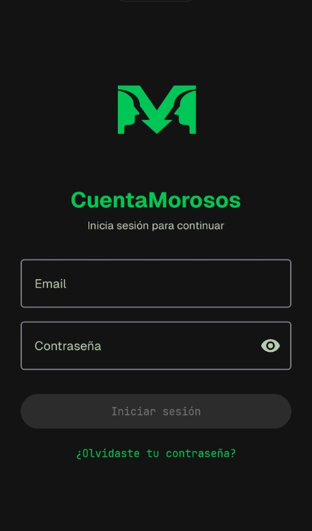

# CuentaMorosos

<div align="center">
  
  <p><em>Divide gastos. Sin vueltas. Sin cuentas pendientes.</em></p>
</div>

---

**CuentaMorosos** es una aplicación Android y Kotlin Multiplatform (KMP) para gestionar gastos compartidos en eventos del día a día: viajes, cenas, fiestas, pisos compartidos y más. El problema es conocido: alguien paga por todos, aparecen cuentas pendientes, nadie recuerda quién debe a quién. CuentaMorosos lo resuelve calculando automáticamente las deudas con el mínimo de transferencias posibles.

Tres diferenciales definen el proyecto: (a) un **motor de liquidación inteligente** que minimiza el número de transferencias entre personas usando un algoritmo greedy, (b) funciona **sin conexión** y sincroniza con Firebase cuando hay red, y (c) es **código abierto** (MIT) construido con Kotlin Multiplatform para Android, JVM e iOS.

El proyecto está en desarrollo activo. Te invitamos a probarlo, reportar issues y contribuir. Empieza por la [sección de instalación](#-instalación-y-ejecución).

---

## 🛠️ Stack Tecnológico

### Core

| Componente | Versión | Capa |
|-----------|---------|------|
| Kotlin | 1.9.24 | Lenguaje |
| Android Gradle Plugin | 8.5.2 | Build |
| Compose Multiplatform | 1.6.11 | UI Framework |
| Kotlin Compiler Extension (Compose) | 1.5.14 | Compilador |
| JVM Target | 17 | Runtime |
| compileSdk / targetSdk | 35 | Android |
| minSdk | 24 | Android |

### UI

| Componente | Versión | Capa |
|-----------|---------|------|
| Jetpack Compose BOM | 2024.06.00 | UI |
| Material 3 | via BOM | Design System |
| Coil (KMP) | 3.0.4 | Imágenes |
| Coil Compose | 3.0.4 | Imágenes |
| Coil Network (OkHttp) | 3.0.4 | Imágenes |
| Lifecycle ViewModel KMP | 2.8.0 | Arquitectura |
| Lifecycle Runtime Compose KMP | 2.8.0 | Arquitectura |
| Activity Compose | 1.9.1 | Android |
| Core KTX | 1.13.1 | Android |
| Lifecycle Runtime KTX | 2.8.4 | Android |

### Datos / Backend

| Componente | Versión | Capa |
|-----------|---------|------|
| Firebase BOM | 33.6.0 | Backend |
| Firebase Auth KTX | via BOM | Autenticación |
| Firebase Firestore KTX | via BOM | Base de datos |
| Firebase Storage KTX | via BOM | Almacenamiento |
| Firebase Messaging KTX | via BOM | Notificaciones |
| dev.gitlive:firebase-auth | 1.13.0 | Auth (KMP) |
| dev.gitlive:firebase-firestore | 1.13.0 | Firestore (KMP) |
| Google Services Plugin | 4.4.2 | Build |

### Almacenamiento Local

| Componente | Versión | Capa |
|-----------|---------|------|
| SQLDelight | 2.0.2 | Base de datos |
| SQLDelight Coroutines Extensions | 2.0.2 | Async |
| SQLDelight Android Driver | 2.0.2 | Android |
| SQLDelight SQLite Driver | 2.0.2 | JVM |

### Async / Concurrencia

| Componente | Versión | Capa |
|-----------|---------|------|
| Kotlinx Coroutines Core | 1.8.1 | Concurrencia |
| Kotlinx Coroutines Android | 1.8.1 | Android |
| Kotlinx DateTime | 0.6.1 | Fechas |
| WorkManager Runtime KTX | 2.9.1 | Tareas en segundo plano |

### Testing

| Framework | Versión | Tipo |
|-----------|---------|------|
| JUnit 4 | 4.13.2 | Unit (app) |
| Kotlin Test | via kotlin("test") | Unit (shared) |
| Kotlinx Coroutines Test | 1.8.1 | Unit |
| Robolectric | 4.13 | Unit (Android) |
| AndroidX Test Core | 1.6.1 | Unit |
| AndroidX Test Ext JUnit | 1.2.1 | Unit / Instrumented |
| Espresso | 3.6.1 | Instrumented |
| Compose UI Test JUnit4 | via BOM | Instrumented |
| JSON (org.json) | 20231013 | Unit (app) |

> **Nota**: El proyecto **no utiliza** framework de inyección de dependencias (Hilt/Koin), linter (detekt/ktlint) ni formateador (ktfmt). La DI se gestiona manualmente mediante `AppViewModelFactory` y `RepositoryProvider`.

---

## 🚀 Instalación y Ejecución

### Paso a paso rápido

1. **Clona el repositorio**:
   ```bash
   git clone https://github.com/tuusuario/CuentaMorosos.git
   cd CuentaMorosos
   ```
2. **Obtené `google-services.json`** del equipo del proyecto y colocálo en `app/` (ver [Firebase](#firebase)).
3. **Abre en Android Studio**: File → Open → selecciona la carpeta del proyecto. Android Studio descargará el SDK y las dependencias Gradle automáticamente.
4. **Ejecuta en emulador o dispositivo**:
   ```bash
   ./gradlew installDebug
   ```
   O pulsa ▶️ Run en Android Studio.

### Prerrequisitos

| Requisito | Versión / Detalle |
|-----------|-------------------|
| **JDK** | 17 (configurado en `gradle.properties`) |
| **Android SDK** | compileSdk 35, minSdk 24 |
| **Android Studio** | Hedgehog (2023.1.1) o superior |
| **Firebase** | Proyecto configurado (ver sección siguiente) |
| **macOS** | Solo para compilar el target iOS (excluido automáticamente en Linux/Windows) |
| **Emulador / dispositivo** | Android 7.0 (API 24) o superior |

### Firebase

CuentaMorosos usa Firebase (Authentication, Firestore, Storage, Cloud Messaging) como backend. La app apunta a un proyecto Firebase existente — **no tiene sentido crear uno nuevo**, porque la base de datos estaría vacía.

Para correr la app necesitás el archivo `google-services.json` del proyecto Firebase de CuentaMorosos. Pedilo al equipo del proyecto y colocálo en `app/`. Este archivo está en `.gitignore` — **nunca se commitea**.

Si querés levantar tu propia instancia (por ejemplo, para desarrollo o fork), los pasos son:

1. Creá un proyecto en [Firebase Console](https://console.firebase.google.com/).
2. Activá **Authentication** → proveedor **Email/Password**.
3. Creá **Firestore Database** en modo producción y configurá las [reglas de seguridad](https://firebase.google.com/docs/firestore/security/get-started).
4. Activá **Storage** para las fotos de perfil.
5. Descargá el `google-services.json` de tu proyecto y colocálo en `app/`.
6. (Opcional) Activá **Cloud Messaging** para notificaciones push.

### Variables de entorno / archivos de configuración

- `local.properties`: Gradle lo genera automáticamente con `sdk.dir`. Si usás Android Studio, no necesitás tocarlo.
- `google-services.json`: en `app/`, excluido de git (`.gitignore`). Solicitálo al equipo del proyecto — sin este archivo la compilación fallará.
- `gradle.properties`: ya incluye configuración de JVM (`-Xmx4g`), daemon de Kotlin (`-Xmx2g`), build paralelo y caché de Gradle. Ajustá la memoria si tu equipo tiene menos de 8 GB.

### Firma (signing)

El proyecto incluye configuración de firma para release en `app/build.gradle.kts`. Para generar un APK firmado necesitás tu propio keystore. Por defecto, las builds de debug usan el keystore de desarrollo de Android.

### Comandos útiles

```bash
# Compilar APK debug
./gradlew assembleDebug

# Ejecutar tests unitarios del módulo app (JUnit + Robolectric)
./gradlew test

# Ejecutar tests del módulo shared (Kotlin test + coroutines)
./gradlew :shared:allTests

# Ejecutar tests de instrumentación (requiere emulador o dispositivo conectado)
./gradlew connectedAndroidTest

# Instalar en emulador o dispositivo conectado
./gradlew installDebug

# Compilar APK release (requiere keystore configurado)
./gradlew assembleRelease
```

<p align="center">
  <em>Pantalla de inicio de sesión una vez configurado el proyecto</em><br/>
  
</p>

---

## 📁 Estructura del Proyecto

```
CuentaMorosos/
├── app/                                    # Módulo Android (shell)
│   ├── build.gradle.kts                    # AGP, Firebase BOM, signing, dependencias
│   └── src/
│       ├── main/
│       │   ├── AndroidManifest.xml
│       │   ├── google-services.json        # Firebase (gitignored)
│       │   ├── res/                        # Drawables, mipmaps (iconos), themes
│       │   └── java/com/cuentamorosos/
│       │       ├── CuentaMorososApp.kt     # Application class, singleton
│       │       ├── MainActivity.kt         # Entry point, auth flow, deep links
│       │       ├── data/                   # LocalStore, FCM, ReminderWorker, MigrationManager, UserSync
│       │       ├── notifications/          # NotificationDispatcher (Android)
│       │       └── ui/auth/               # MigrationScreen (legacy data)
│       └── test/                           # 7 tests (LocalStore, FCM, dedup)
│
├── shared/                                 # Módulo KMP (lógica + UI compartida)
│   ├── build.gradle.kts                    # KMP plugin, Compose, SQLDelight, targets
│   └── src/
│       ├── commonMain/
│       │   ├── composeResources/           # Fuentes (Geist, JetBrains Mono)
│       │   ├── kotlin/com/cuentamorosos/
│       │   │   ├── model/                  # 8 engines: SplitCalculator, SettlementEngine,
│       │   │   │                           #   PermissionEngine, IntegrityGuard, StateMachine,
│       │   │   │                           #   CalculatorEngine, EventCreditorResolver
│       │   │   │                           #   + validation/ (4 validadores)
│       │   │   ├── ui/                     # 49 archivos: screens, ViewModels, design system NeoFintech
│       │   │   │   └── auth/               # Login, Register, ForgotPassword, SplashAuth, UserProfile
│       │   │   ├── data/repository/        # 21 repositorios (interfaces, Firestore, OfflineFirst)
│       │   │   ├── db/                     # DriverFactory (expect)
│       │   │   └── notifications/          # Modelos de notificación, deep links
│       │   └── sqldelight/                 # 8 esquemas .sq (CachedEvent, CachedProfile, etc.)
│       ├── commonTest/                     # 41 tests (engines, ViewModels, repos, UI)
│       ├── androidMain/                    # Platform.android, AppViewModelFactory,
│       │                                   #   RepositoryProvider, DriverFactory, NetworkMonitor,
│       │                                   #   SystemBackHandler
│       ├── jvmMain/                        # Platform.jvm, DriverFactory, NetworkMonitor (JVM desktop)
│       └── iosMain/                        # Platform.ios, DriverFactory, NetworkMonitor,
│                                           #   SystemBackHandler (iOS)
│
├── iosApp/                                 # Xcode project (wrapper iOS, condicional)
├── keystore/                               # Clave de firma (release)
├── docs/                                   # Capturas de pantalla
├── documentation/                          # CHANGELOG, FR, NFR, sprints, UI, API docs
├── openspec/                               # Artefactos SDD (specs, changes, archive)
├── .github/                                # CI/CD workflows, agentes, skills
├── gradle/                                 # Wrapper (gradle-wrapper.jar, gradle-wrapper.properties)
├── build.gradle.kts                        # Root: plugins y versiones
├── settings.gradle.kts                     # Includes de módulos, repositorios
├── gradle.properties                       # JVM args, propiedades de build
├── gradlew / gradlew.bat                   # Gradle wrapper
├── README.md                               # Este archivo
├── AGENTS.md                               # Guía para asistentes de IA
├── LICENSE                                 # MIT
└── logoCuentaMorosos.svg                   # Logo de la app
```

### Módulos

| Módulo | Tipo | Descripción |
|--------|------|-------------|
| `app/` | Android Application | Shell Android: entry point, Firebase SDK nativo, notificaciones, WorkManager |
| `shared/` | Kotlin Multiplatform | Lógica de negocio + UI Compose compartida entre Android, JVM e iOS |
| `iosApp/` | iOS Xcode Project | Envoltorio SwiftUI para iOS (compilación condicional en macOS) |

---

## ⚡ Funcionalidades Principales

### 📅 Eventos

- **CRUD completo**: crea, edita y elimina eventos con nombre, fechas de inicio/fin y moneda base.
- **Ciclo de vida estricto**: los eventos transitan por tres estados controlados por `StateMachine`:
  - **Abierto** (`OPEN`): se pueden agregar y quitar gastos.
  - **Calculado** (`CALCULATED`): las deudas están calculadas, se registran pagos.
  - **Cerrado** (`CLOSED`): solo lectura, todas las transferencias están saldadas.
- **Roles por participante**:
  - **Propietario** (`OWNER`): control total — calcular, cerrar, reabrir, eliminar, gestionar roles.
  - **Colaborador** (`CONTRIBUTOR`): crea y edita sus propios gastos, ve todo.
  - **Lector** (`READER`): acceso de solo lectura.
- **Invitaciones por email**: invita a otras personas a unirse a tus eventos. Flujo pendiente → aceptar → rechazar.
- **Vista de calendario**: navegación visual por la línea temporal de eventos.

<p align="center">
  
  
</p>
<p align="center">
  
</p>

### 💸 Gastos

- **6 modos de reparto** disponibles al crear un gasto:
  | Modo | ID | ¿Cómo funciona? |
  |------|----|-----------------|
  | Consumo real | `real_consumption` | Cada ítem se reparte solo entre los perfiles asignados |
  | Media simple | `simple_avg` | División a partes iguales entre todos los participantes |
  | Por categoría | `by_category` | Ítems compartidos se dividen entre todos; el resto, entre asignados |
  | % personalizado | `custom_percentage` | Cada perfil paga un porcentaje (debe sumar 100 %) |
  | Importe exacto | `exact` | Cada perfil paga un importe fijo (debe coincidir con el total) |
  | Por partes | `parts` | Cada perfil pone partes enteras (1-100); reparto proporcional |
- **11 categorías** con iconos y colores: Gasto grupal, Vuelo, Alojamiento, Comida, Transporte, Ocio, Compras, Salud, Educación, Servicios, Otro.
- **Soporte multi-moneda**: campos `exchangeRate` e `itemCurrency` preparados para conversión futura (actualmente EUR).
- **Auditoría inmutable**: cada operación CRUD sobre gastos genera un registro `ExpenseAuditEntry` inalterable.

<p align="center">
  
</p>

### ⚖️ Liquidación

- **Algoritmo greedy**: calcula la cantidad mínima de transferencias necesarias para saldar todas las deudas (`SettlementEngine.kt`).
- **Casos borde detectados**: saldos compensados internamente, acreedores eliminados, balances en cero.
- **Versionado de cálculos**: cada ejecución genera un `CalculationVersion` inmutable; las versiones anteriores se preservan.
- **Ajustes**: `AdjustmentEntry` permite corregir transferencias cobradas sin modificar la deuda original.
- **Moneda**: EUR para esta versión (`SUPPORTED_CURRENCY = "EUR"`).
- **Guardián de integridad**: `IntegrityGuard` impide recalcular si faltan participantes previos y valida los datos antes del cálculo.

<p align="center">
  
</p>

### 👤 Perfiles

- **Gestión completa**: crea, edita y elimina perfiles con nombre, emoji de icono y email vinculado.
- **Perfiles fantasma**: perfiles temporales (`isGhost = true`) para participantes puntuales sin cuenta.
- **Nombres personalizados**: cada usuario puede asignar un nombre visible distinto al de otros perfiles (`customNames`).
- **Foto de perfil**: subida de imagen a Firebase Storage, vinculada al perfil de autenticación.
- **Resumen de balances**: posición neta por perfil (saldo positivo = te deben, negativo = debes).
- **Configuración de cuenta**: cambio de contraseña, nombre de usuario, foto y nombre visible.

### 📊 Panel

- **Resumen financiero**: total gastado, tu parte vs. lo que te deben, por evento.
- **Balances por perfil**: quién debe a quién, posiciones netas.
- **Deudas pendientes por perfil**: desglose de qué debe cada persona.
- **Acceso al calendario**: navegación rápida a la vista de calendario.

<p align="center">
  
</p>

### 🔔 Notificaciones

- **Recordatorios locales**: `ReminderWorker` (WorkManager, diario) para deudas pendientes, eventos incompletos y próximos eventos.
- **Notificaciones push**: `CuentaMorososFirebaseMessagingService` (FCM) para invitaciones y cálculos nuevos.
- **Desduplicación**: sistema de huellas (`fingerprint`) en `CuentaMorososLocalStore` que evita notificaciones repetidas.
- **Deep links**: las notificaciones navegan directamente al evento o invitación correspondiente.

### 📡 Soporte Offline

- **Repositorios offline-first**: todos los datos se cachean en SQLDelight y se sincronizan con Firestore al reconectar.
- **Cola de operaciones pendientes**: `PendingOperationQueue` persiste en SQL las operaciones remotas fallidas y las reintenta al recuperar conexión.
- **Sincronización escalonada**: eventos → deudas → gastos → perfiles, con 500 ms de retardo entre cada repositorio.
- **Indicador visual**: banner que muestra el estado de la conexión en la UI.
- **Monitor de red**: interfaz `NetworkMonitor` con implementación específica por plataforma (`ConnectivityManager` en Android).

---

## 🏗️ Arquitectura

### Patrón: Repositorio Offline-First

```
┌─────────────────────────────────────────────────────────────┐
│                     App Module (Android)                     │
│  MainActivity → CuentaMorososApp (singleton)                │
│  Notification services, Firebase native SDK, WorkManager     │
└──────────────────────────┬──────────────────────────────────┘
                           │
┌──────────────────────────▼──────────────────────────────────┐
│                 Shared Module (KMP)                          │
│                                                              │
│  ┌─────────┐    ┌──────────────┐    ┌────────────────────┐  │
│  │   UI    │───▶│  ViewModels   │───▶│    Repositories    │  │
│  │ Compose │    │ StateFlow +   │    │  OfflineFirst*     │  │
│  │ Screens │    │ derivedStateOf│    │  cachea SQLDelight │  │
│  │         │    │               │    │  → sync Firestore  │  │
│  └─────────┘    └──────┬───────┘    └────────┬───────────┘  │
│                        │                      │              │
│                        ▼                      ▼              │
│              ┌─────────────────┐    ┌──────────────────┐    │
│              │  Model Engines  │    │  Local Cache      │    │
│              │  SplitCalculator│    │  SQLDelight (SQL) │    │
│              │  SettlementEng. │    │  8 tables         │    │
│              │  PermissionEng. │    └──────────────────┘    │
│              │  IntegrityGuard │                            │
│              │  StateMachine   │    ┌──────────────────┐    │
│              └─────────────────┘    │  Pending Queue    │    │
│                                     │  Offline retry    │    │
│                                     └──────────────────┘    │
│                                                              │
│  ┌───────────────────────────────────────────────────────┐  │
│  │              Design System: NeoFintech                │  │
│  │  Dark theme, neon accents, custom typography/spacing  │  │
│  │  MoneyExplosionAnimation, animated transitions        │  │
│  └───────────────────────────────────────────────────────┘  │
└──────────────────────────────────────────────────────────────┘
```

### Decisiones Clave de Diseño

1. **Módulo compartido KMP**: la lógica de negocio y la UI Compose viven en `shared/` para reutilización entre plataformas. El módulo `app/` es un shell Android delgado.
2. **Patrón repositorio OfflineFirst en tres capas**: cada entidad define una interfaz (ej. `EventRepository`). Existen dos implementaciones: `Firestore*Repository` para la parte remota y `OfflineFirst*Repository` para la parte local. Esta última cachea en SQLDelight (8 tablas, reactivas vía `Flow`) y sincroniza escrituras a Firestore delegando en el repositorio remoto. Si la red falla, las operaciones se encolan en `PendingOperationQueue` y se reintentan al reconectar.
3. **Persistencia dual**: SQLDelight como caché primaria + `CuentaMorososLocalStore` (SharedPreferences) solo para migración de datos legacy y desduplicación de notificaciones.
4. **Motores de modelo puros**: 8 engines (`SplitCalculator`, `SettlementEngine`, `PermissionEngine`, `IntegrityGuard`, `StateMachine`, `CalculatorEngine`, `EventCreditorResolver` + `validation/` con 4 validadores) en Kotlin puro sin dependencias de framework — 100 % testeables.
5. **DI manual**: sin Hilt ni Koin. `AppViewModelFactory` construye ViewModels, `RepositoryProvider` cablea los repositorios.
6. **`derivedStateOf` para propiedades computadas**: agregados del panel, balances netos y mensajes de recordatorio se calculan reactivamente.
7. **Sincronización escalonada**: 500 ms de retardo entre repositorios al iniciar para no saturar Firestore.
8. **`PendingOperationQueue`**: operaciones remotas fallidas se persisten en SQLDelight y se reintentan con backoff exponencial al reconectar.

### Ejemplo de Flujo de Datos: Crear un Gasto

```
Usuario rellena formulario en EventDetailScreen
  → EventDetailViewModel.saveExpense(expense)
    → OfflineFirstExpenseRepository.saveExpense(expense)
      → 1. SQLDelight INSERT (caché local — UI se actualiza al instante)
      → 2. FirestoreExpenseRepository.saveExpense(expense) (remoto)
        → ✅ éxito: fin
        → ❌ sin red: PendingOperationQueue.enqueue(expense)
                     → se reintenta al recuperar conexión
```

---

## 🧪 Testing

### Frameworks

| Framework | Tipo | Módulo | Comando |
|-----------|------|--------|---------|
| JUnit 4 + Robolectric | Unit tests | `app/` | `./gradlew test` |
| Kotlin Test + kotlinx-coroutines-test | Unit tests | `shared/` | `./gradlew :shared:allTests` |
| Espresso + Compose UI Test | Instrumented | `app/` | `./gradlew connectedAndroidTest` |

### Ejecución

```bash
# Tests unitarios del módulo app
./gradlew test

# Tests unitarios del módulo shared (KMP)
./gradlew :shared:allTests

# Tests de instrumentación (requiere emulador/dispositivo)
./gradlew connectedAndroidTest

# Todos los tests
./gradlew test :shared:allTests connectedAndroidTest
```

> **Cobertura actual**: 48 archivos de test (41 en `shared/commonTest`, 7 en `app/src/test`). Sin herramienta de cobertura (JaCoCo) configurada.

---

## 📚 Recursos Adicionales

- **[Documentación del proyecto](documentation/README.md)**: índice completo con requisitos funcionales, no funcionales, diseño, sprints y API.
- **[Guía para agentes de IA](AGENTS.md)**: convenciones de desarrollo, arquitectura, patrones y reglas para asistentes de código.
- **[Licencia MIT](LICENSE)**: texto completo de la licencia.
- **[SDD (Spec-Driven Development)](openspec/)**: artefactos de especificación, cambios activos y archivo histórico.


