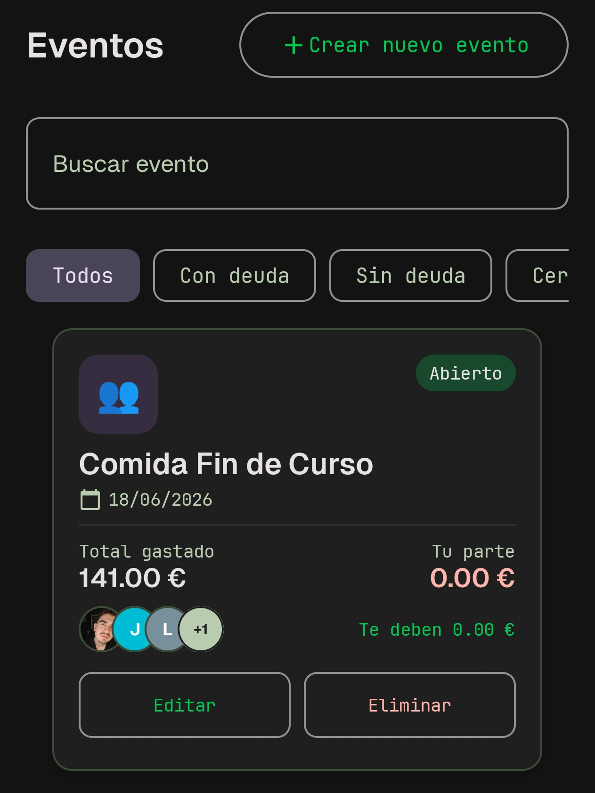
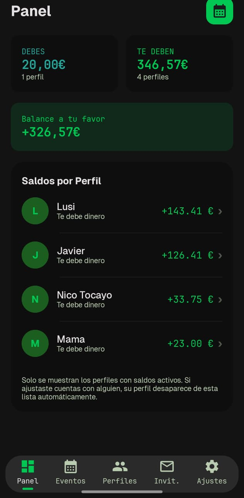
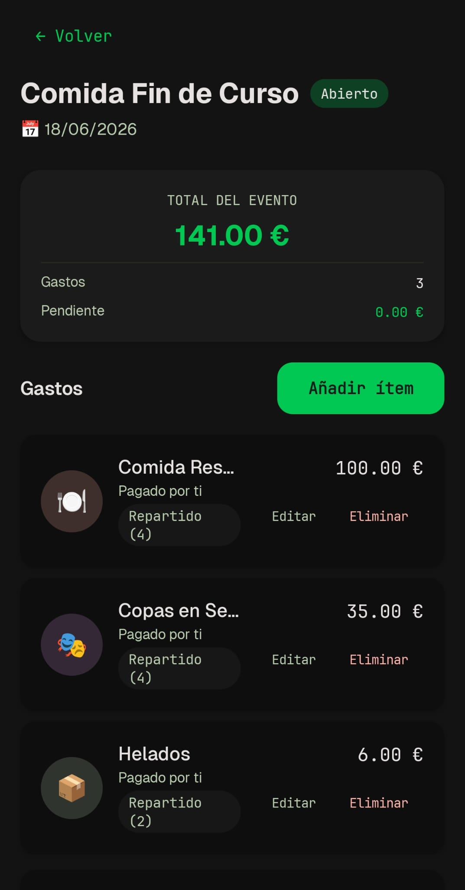
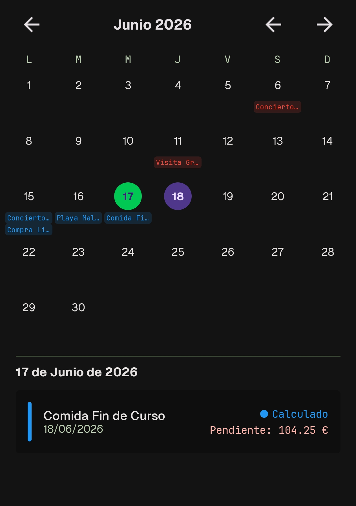
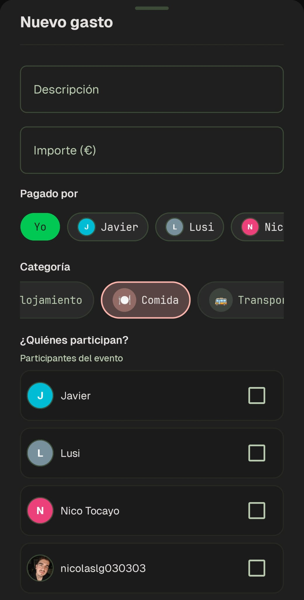
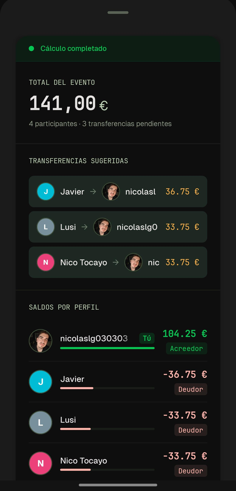

# CuentaMorosos

<div align="center">
  
  <p><em>Divide gastos. Minimiza transferencias. Cero deudas pendientes.</em></p>

  <a href="https://github.com/naigel89/CuentaMorosos/releases/latest">
    
  </a>
  <a href="https://github.com/naigel89/CuentaMorosos/releases/latest">
    
  </a>
  <a href="https://github.com/naigel89/CuentaMorosos/actions/workflows/android-build.yml">
    
  </a>
</div>

---

**CuentaMorosos** (moroso = alguien que no paga lo que debe) es una aplicación Android
construida con Kotlin Multiplatform que he desarrollado para gestionar gastos
compartidos en eventos del día a día: viajes, cenas, fiestas, pisos compartidos y
más. El problema es conocido: alguien paga por todos, aparecen cuentas pendientes,
nadie recuerda quién debe a quién.

Este proyecto resuelve ese caos con tres diferenciales clave:

1. **Motor de liquidación inteligente** — algoritmos greedy + round-robin que calculan
   las deudas minimizando el número de transferencias entre participantes. No es un
   simple "divide y vencerás": respeta quién pagó qué y cómo se repartió cada ítem.
2. **Offline-first con sincronización diferida** — funciona sin conexión con caché
   local en SQLDelight, y sincroniza con Firebase cuando hay red. Las operaciones
   fallidas se encolan y reintentan al reconectar.
3. **Código abierto (MIT) con arquitectura KMP** — toda la lógica de negocio y la UI
   Compose se comparten entre Android, JVM e iOS desde un mismo módulo Kotlin
   Multiplatform.

El proyecto está en desarrollo activo. Te invito a probarlo, reportar issues y
contribuir. Empieza por la [sección de instalación](#-instalación-y-ejecución).

<p align="center">
  
  
  
</p>

---

## 📋 Índice

- [🚀 Funcionalidades](#-funcionalidades)
- [🛠️ Stack Tecnológico](#-stack-tecnológico)
- [📦 Instalación y Ejecución](#-instalación-y-ejecución)
- [📁 Estructura del Proyecto](#-estructura-del-proyecto)
- [🏗️ Arquitectura](#️-arquitectura)
- [🧪 Testing](#-testing)
- [🤝 Contribuir](#-contribuir)
- [🗺️ Roadmap](#️-roadmap)
- [📄 Licencia](#-licencia)

---

## 🚀 Funcionalidades

### 📅 Eventos

He diseñado los eventos con un ciclo de vida estricto de tres estados —**Abierto**,
**Calculado**, **Cerrado**— controlado por una `StateMachine` que garantiza que no
se puedan añadir gastos después de liquidar ni reabrir un evento saldado sin pasar
por el flujo correcto.

Cada evento soporta **roles por participante**:
- **Propietario**: control total — calcular, cerrar, reabrir, eliminar, gestionar roles.
- **Colaborador**: crea y edita sus propios gastos, ve todo.
- **Lector**: acceso de solo lectura.

El sistema de **invitaciones** permite invitar a otras personas por email o @username,
con búsqueda por nombre de usuario que filtra automáticamente a los participantes
existentes. Cada invitación pasa por un flujo pendiente → aceptar → rechazar.

Además de la vista de lista, los eventos se pueden explorar a través de una
**vista de calendario** que facilita la navegación temporal.

<p align="center">
  
  
  
</p>

### 💸 Gastos

Los gastos son el núcleo de la aplicación. He implementado **6 modos de reparto**
para adaptarse a cualquier situación:

| Modo | Cómo funciona |
|------|---------------|
| Consumo real | Cada ítem se reparte solo entre los perfiles asignados |
| Media simple | División a partes iguales entre todos los participantes |
| Por categoría | Ítems compartidos se dividen entre todos; el resto, entre asignados |
| % personalizado | Cada perfil paga un porcentaje (debe sumar 100 %) |
| Importe exacto | Cada perfil paga un importe fijo (debe coincidir con el total) |
| Por partes | Cada perfil pone partes enteras (1-100); reparto proporcional |

Cada gasto se clasifica en **11 categorías** con iconos y colores propios: Gasto
grupal, Vuelo, Alojamiento, Comida, Transporte, Ocio, Compras, Salud, Educación,
Servicios y Otro. El modelo está preparado para **soporte multi-moneda** (campos
`exchangeRate` e `itemCurrency`), aunque la versión actual trabaja con EUR.

Todas las operaciones CRUD sobre gastos generan un registro de auditoría
(`ExpenseAuditEntry`) inmutable, lo que permite trazabilidad completa.

<p align="center">
  
</p>

### ⚖️ Liquidación

La liquidación es donde el proyecto marca la diferencia técnica. He implementado
un **algoritmo greedy** que minimiza el número de transferencias entre participantes
—no es un simple reparto lineal— combinado con un sistema **round-robin** en
`SplitCalculator` para que los remanentes de redondeo no recaigan siempre sobre la
misma persona por orden alfabético.

El **modo `REAL_CONSUMPTION`** calcula las deudas respetando quién pagó cada ítem
y cómo se dividió, en lugar de promediar entre todos. La aplicación de
transferencias (`applyCalculation()`) es **atómica y secuencial**: recibe los
índices de transferencias pagadas y se ejecuta dentro de un `Mutex` que evita
colisiones con la sincronización en segundo plano.

Otras características:
- Panel de liquidación con selección múltiple de deudas (checkbox).
- Detección de casos borde: saldos compensados, acreedores eliminados, balances en cero.
- Versionado de cálculos: cada ejecución genera un `CalculationVersion` inmutable.
- Ajustes mediante `AdjustmentEntry` para corregir transferencias cobradas sin alterar la deuda original.
- Un `IntegrityGuard` impide recalcular si faltan participantes previos y valida los datos antes del cálculo.

<p align="center">
  
</p>

### 👤 Perfiles

El sistema de perfiles incluye una funcionalidad que me parece especialmente útil:
los **perfiles fantasma**. Cuando invitas a alguien que aún no tiene cuenta, se crea
un perfil temporal (`isGhost = true`). Cuando esa persona se registra, el sistema
reconcilia automáticamente sus deudas, gastos y participaciones —todo migra al perfil
real y el fantasma se elimina.

Cada perfil puede llevar **nombre personalizado** visible para otros usuarios
(`customNames`), **foto de perfil** subida a Firebase Storage, y un **resumen de
balances** que muestra la posición neta (saldo positivo = te deben, negativo = debes).
La configuración de cuenta permite cambiar contraseña, nombre de usuario, foto y
nombre visible.

### 📊 Panel

El panel de control ofrece una vista rápida del estado financiero global: total
gastado, tu parte versus lo que te deben, desglosado por evento. Muestra quién
debe a quién con posiciones netas, el detalle de deudas pendientes por perfil, y
acceso directo al calendario.

### 🔔 Notificaciones

He montado un sistema de notificaciones de tres capas:
- **Recordatorios locales** vía `ReminderWorker` (WorkManager, ejecución diaria) para
  deudas pendientes, eventos incompletos y próximos eventos.
- **Notificaciones push** (FCM) para invitaciones y cálculos nuevos.
- **Desduplicación** mediante huellas (`fingerprint`) en `CuentaMorososLocalStore`.
- **Deep links**: las notificaciones navegan directamente al evento o invitación correspondiente.

### 📡 Soporte Offline

Todos los datos se cachean en SQLDelight y se sincronizan con Firestore al reconectar.
He puesto especial cuidado en evitar condiciones de carrera: un `Mutex` protege el
ciclo de sincronización para que no aplique deudas mientras el usuario está calculando
una liquidación. Las eliminaciones que fallan por problemas de red se encolan en
`PendingEventDeletes` junto con la cola general de operaciones pendientes.

La sincronización es escalonada (eventos → deudas → gastos → perfiles, con 500 ms
de retardo entre cada repositorio) para no saturar Firestore. Un indicador visual
en la UI muestra el estado de la conexión, y el `NetworkMonitor` tiene
implementación específica por plataforma.

---

## 🛠️ Stack Tecnológico

| Componente | Versión | Propósito |
|-----------|---------|-----------|
| Kotlin | 1.9.24 | Lenguaje principal |
| Compose Multiplatform | 1.6.11 | UI Framework compartido |
| Android Gradle Plugin | 8.5.2 | Build Android |
| Jetpack Compose BOM | 2024.06.00 | Librerías Compose (Material 3, etc.) |
| Coil (KMP) | 3.0.4 | Carga de imágenes |
| Lifecycle ViewModel Compose (KMP) | 2.8.0 | Arquitectura MVVM multiplataforma |
| Firebase BOM | 33.6.0 | Backend (Auth, Firestore, Storage, FCM) |
| dev.gitlive (Firebase KMP) | 1.13.0 | Firebase Auth / Firestore desde KMP |
| SQLDelight | 2.0.2 | Base de datos local (caché offline) |
| Kotlinx Coroutines | 1.8.1 | Concurrencia y async |
| Kotlinx DateTime | 0.6.1 | Manejo de fechas |
| WorkManager | 2.9.1 | Tareas en segundo plano (recordatorios) |
| JUnit 4 / Kotlin Test | — | Tests unitarios |
| Robolectric | 4.13 | Tests unitarios con framework Android |
| Espresso + Compose UI Test | — | Tests de instrumentación |

> **Sin framework de inyección de dependencias**: la DI se gestiona manualmente
> mediante `AppViewModelFactory` y `RepositoryProvider`. Tampoco uso linter ni
> formateador automático.

---

## 📦 Instalación y Ejecución

### Paso a paso rápido

1. **Clona el repositorio**:
   ```bash
   git clone https://github.com/tuusuario/CuentaMorosos.git
   cd CuentaMorosos
   ```
2. **Obtén `google-services.json`** del proyecto Firebase de CuentaMorosos
   (consulta [Firebase](#firebase)) y colócalo en `app/`.
3. **Abre en Android Studio**: File → Open → selecciona la carpeta del proyecto.
   Android Studio descargará el SDK y las dependencias Gradle automáticamente.
4. **Ejecuta en emulador o dispositivo**:
   ```bash
   ./gradlew installDebug
   ```
   O pulsa ▶️ Run en Android Studio.

### Prerrequisitos

| Requisito | Versión / Detalle |
|-----------|-------------------|
| **JDK** | 17 |
| **Android SDK** | compileSdk 35, minSdk 24 |
| **Android Studio** | Hedgehog (2023.1.1) o superior |
| **Firebase** | Proyecto configurado (ver sección siguiente) |
| **macOS** | Solo para compilar el target iOS (excluido en Linux/Windows) |
| **Emulador / dispositivo** | Android 7.0 (API 24) o superior |

### Firebase

CuentaMorosos usa Firebase (Authentication, Firestore, Storage, Cloud Messaging)
como backend. La app apunta a un proyecto Firebase existente — **no tiene sentido
crear uno nuevo**, porque la base de datos estaría vacía.

Para ejecutar la app necesitas el archivo `google-services.json` del proyecto
Firebase de CuentaMorosos. Puedes solicitar acceso al proyecto abriendo un
[issue](https://github.com/naigel89/CuentaMorosos/issues) y coloca el archivo
en `app/`.
Este archivo está en `.gitignore` — **nunca se commitea**.

Si quieres levantar tu propia instancia (por ejemplo, para desarrollo o fork),
los pasos son:

1. Crea un proyecto en [Firebase Console](https://console.firebase.google.com/).
2. Activa **Authentication** → proveedor **Email/Password**.
3. Crea **Firestore Database** en modo producción y configura las
   [reglas de seguridad](https://firebase.google.com/docs/firestore/security/get-started).
4. Activa **Storage** para las fotos de perfil.
5. Descarga el `google-services.json` de tu proyecto y colócalo en `app/`.
6. (Opcional) Activa **Cloud Messaging** para notificaciones push.

### Variables de entorno / archivos de configuración

- `local.properties`: Gradle lo genera automáticamente con `sdk.dir`.
- `google-services.json`: en `app/`, excluido de git (`.gitignore`). Sin este
  archivo la compilación fallará.
- `gradle.properties`: incluye configuración de JVM (`-Xmx4g`), daemon de Kotlin
  (`-Xmx2g`), build paralelo y caché de Gradle. Ajusta la memoria si tu equipo
  tiene menos de 8 GB.

### Firma (signing)

El proyecto incluye configuración de firma para release en `app/build.gradle.kts`.
Para generar un APK firmado necesitas tu propio keystore. Las builds de debug
usan el keystore de desarrollo de Android.

### Comandos útiles

```bash
# Compilar APK debug
./gradlew assembleDebug

# Ejecutar tests unitarios del módulo app (JUnit + Robolectric)
./gradlew test

# Ejecutar tests del módulo shared (Kotlin test + coroutines)
./gradlew :shared:allTests

# Ejecutar tests de instrumentación (requiere emulador o dispositivo conectado)
./gradlew connectedAndroidTest

# Instalar en emulador o dispositivo conectado
./gradlew installDebug

# Compilar APK release (requiere keystore configurado)
./gradlew assembleRelease
```

---

## 📁 Estructura del Proyecto

```
CuentaMorosos/
├── app/                          # Shell Android (entry point, Firebase SDK nativo)
├── shared/                       # Módulo KMP con lógica + UI compartida
│   └── src/
│       ├── commonMain/           # Lógica multiplataforma (modelos, UI, repositorios, BD)
│       ├── commonTest/           # Tests compartidos (48 archivos)
│       ├── androidMain/          # Implementaciones Android (DriverFactory, ViewModelFactory)
│       ├── jvmMain/              # Implementaciones JVM (DriverFactory, NetworkMonitor)
│       └── iosMain/              # Implementaciones iOS (DriverFactory, SystemBackHandler)
├── iosApp/                       # Proyecto Xcode (wrapper iOS)
├── docs/                         # Capturas de pantalla
├── documentation/                # CHANGELOG, requisitos, diseño, sprints, UI, API
├── openspec/                     # Artefactos SDD (specs, changes, archive)
├── .github/workflows/            # CI/CD: build android + release
├── gradle/                       # Wrapper de Gradle
├── build.gradle.kts              # Build raíz
├── settings.gradle.kts           # Configuración de módulos
├── gradle.properties             # Propiedades de build
├── AGENTS.md                     # Guía para asistentes de IA
├── LICENSE                       # MIT
└── logoCuentaMorosos.svg         # Logo del proyecto
```

---

## 🏗️ Arquitectura

### Patrón: Repositorio Offline-First

```
┌─────────────────────────────────────────────────────────────┐
│                    App Module (Android)                      │
│  MainActivity → CuentaMorososApp (singleton)                │
│  Notification services, Firebase native SDK, WorkManager     │
└──────────────────────────┬──────────────────────────────────┘
                           │
┌──────────────────────────▼──────────────────────────────────┐
│                   Shared Module (KMP)                        │
│                                                              │
│  ┌──────────────────────┐  ┌────────────────────────────┐   │
│  │  UI Compose Screens   │  │      ViewModels            │   │
│  │  ┌─────────────────┐  │  │  StateFlow + derivedStateOf│   │
│  │  │ NeoFintech DS   │  │  └──────────┬─────────────────┘   │
│  │  │ Dark theme,     │  │             │                     │
│  │  │ neon accents,   │  │             ▼                     │
│  │  │ typography      │  │  ┌────────────────────────────┐   │
│  │  └─────────────────┘  │  │   Repositories             │   │
│  └──────────────────────┘  │  │   OfflineFirst* → cachea  │   │
│                            │  │   SQLDelight → sync       │   │
│                            │  │   Firestore               │   │
│                            │  └────────┬──────────────────┘   │
│                            │           │                      │
│             ┌──────────────┴───────────┴──────────────┐       │
│             │              │                          │       │
│             ▼              ▼                          ▼       │
│  ┌──────────────────┐ ┌────────────────┐ ┌──────────────────┐ │
│  │  Model Engines    │ │  Local Cache   │ │  Pending Queue   │ │
│  │  SplitCalculator  │ │  SQLDelight    │ │  Offline retry   │ │
│  │  SettlementEng.   │ │  8 tables      │ └──────────────────┘ │
│  │  PermissionEng.   │ └────────────────┘                     │
│  │  IntegrityGuard   │                                        │
│  │  StateMachine     │                                        │
│  └──────────────────┘                                         │
└──────────────────────────────────────────────────────────────┘
```

### Decisiones clave de diseño

1. **Módulo compartido KMP**: la lógica de negocio y la UI Compose viven en
   `shared/` para reutilización entre plataformas. `app/` es un shell Android
   delgado.
2. **Repositorio OfflineFirst en tres capas**: interfaz → implementación remota
   (Firestore) → implementación offline-first (SQLDelight + sync). Si la red
   falla, las operaciones se encolan en `PendingOperationQueue` y se reintentan
   al reconectar con backoff exponencial.
3. **Persistencia dual**: SQLDelight como caché primaria + `CuentaMorososLocalStore`
   (SharedPreferences) solo para migración de datos legacy y desduplicación de
   notificaciones.
4. **Motores de modelo puros**: 7 engines en Kotlin sin dependencias de framework
   —100 % testeables.
5. **DI manual**: sin Hilt ni Koin. `AppViewModelFactory` construye ViewModels,
   `RepositoryProvider` cablea los repositorios.
6. **`derivedStateOf`** para propiedades computadas reactivas (balances del panel,
   agregados, recordatorios).
7. **Sincronización escalonada**: 500 ms de retardo entre repositorios al iniciar
   para no saturar Firestore.
8. **Aplicación sincro-safe**: `applyCalculation()` ejecuta transferencias dentro
   de un `Mutex` que bloquea el sync concurrente.
9. **Columnas explícitas en SQLDelight**: se usan nombres de columna en
   `INSERT OR REPLACE` en vez de posición, porque `ALTER TABLE ADD COLUMN` coloca
   la columna al final de la tabla física, rompiendo el orden posicional del schema.

### Ejemplo de flujo: crear un gasto

```
Usuario rellena formulario en EventDetailScreen
  → EventDetailViewModel.saveExpense(expense)
    → OfflineFirstExpenseRepository.saveExpense(expense)
      → 1. SQLDelight INSERT (caché local — UI se actualiza al instante)
      → 2. FirestoreExpenseRepository.saveExpense(expense) (remoto)
        → ✅ éxito: fin
        → ❌ sin red: PendingOperationQueue.enqueue(expense)
                     → se reintenta al recuperar conexión
```

---

## 🧪 Testing

| Framework | Tipo | Módulo | Comando |
|-----------|------|--------|---------|
| JUnit 4 + Robolectric | Unit tests | `app/` | `./gradlew test` |
| Kotlin Test + coroutines | Unit tests | `shared/` | `./gradlew :shared:allTests` |
| Espresso + Compose UI Test | Instrumentados | `app/` | `./gradlew connectedAndroidTest` |

Actualmente hay **55 archivos de test** (48 en `shared/commonTest`, 7 en
`app/src/test`). Sin herramienta de cobertura configurada.

```bash
# Todos los tests
./gradlew test :shared:allTests connectedAndroidTest
```

---

## 🤝 Contribuir

CuentaMorosos es un proyecto personal que he abierto porque creo que el código
abierto mejora cuando más personas lo miran. Si quieres contribuir:

1. **Haz fork** del repositorio y crea una rama desde `main`:
   ```bash
   git checkout -b feature/mi-mejora
   ```
2. **Aplica tus cambios** siguiendo las convenciones del proyecto
   (consulta [AGENTS.md](AGENTS.md) para detalles de arquitectura y estilo).
3. **Ejecuta los tests** antes de abrir el PR:
   ```bash
   ./gradlew test :shared:allTests
   ```
4. **Abre un Pull Request** con una descripción clara del cambio y, si aplica,
   capturas de pantalla de la UI modificada.

Si encuentras un bug o tienes una idea, abre un
[issue](https://github.com/naigel89/CuentaMorosos/issues) antes de escribir código.
Para cambios grandes, mejor abrir un issue de discusión primero.

En la [documentación del proyecto](documentation/README.md) encontrarás el índice
completo de requisitos funcionales, diseño, API y sprints.

---

## 🗺️ Roadmap

El proyecto avanza por sprints. El estado actual:

- ✅ **Sprint 01**: CRUD de eventos, perfiles, navegación, persistencia base.
- ✅ **Sprint 02**: Gastos, 6 modos de reparto, calculadora, liquidación sugerida.
- ✅ **Sprint 03**: Notificaciones locales, ajustes de tema, preferencias persistentes.
- ✅ **Sprint 04**: Deuda técnica, eliminación de eventos/perfiles, WorkManager.
- ✅ **Sprint 05**: Vista de calendario, búsqueda y filtros de eventos.
- ✅ **Sprint 06**: Autenticación Firebase (registro, login, recuperación, email verification gate).
- ✅ **Sprint 07**: Sincronización online (OfflineFirst repos, PendingOperationQueue, sync escalonada).
- ✅ **Sprint 08**: Colaboración (invitaciones, miembros, FCM, ghost profiles, reparto % por ítem).

Consulta la [documentación de sprints](documentation/sprints/) para el detalle
completo. Los issues etiquetados como
[good first issue](https://github.com/naigel89/CuentaMorosos/labels/good%20first%20issue)
son un buen punto de entrada si quieres colaborar.

---

## 📄 Licencia

MIT © 2024 Nicolas – [Ver licencia completa](LICENSE)
